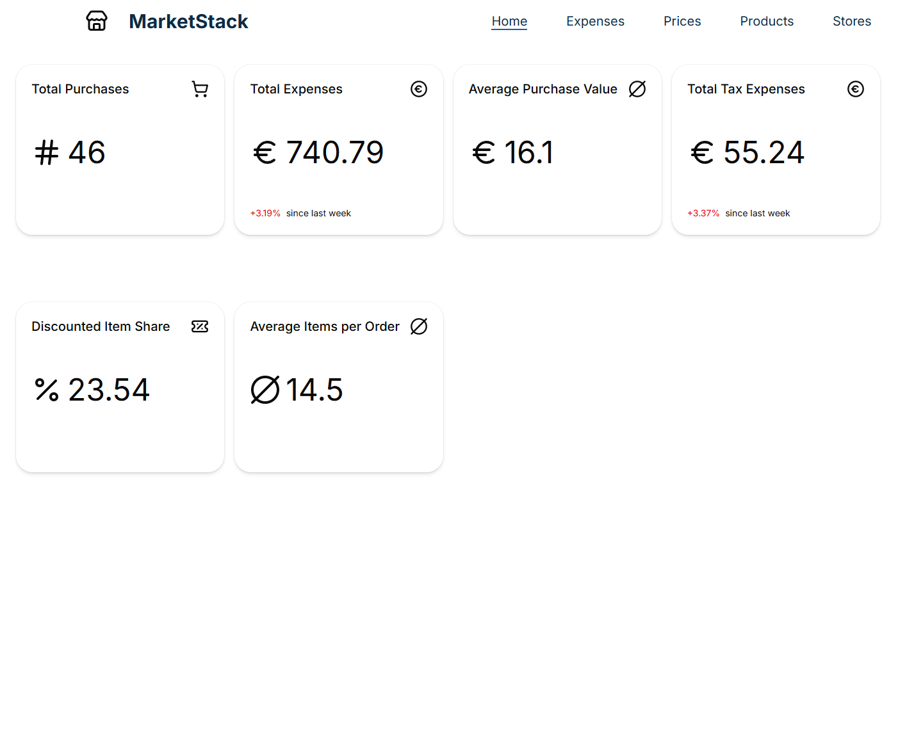

# MarketStack UI

MarketStack UI is the web dashboard for **MarketStack**, a self-hostable platform for collecting and analyzing grocery purchase data from multiple supermarket chains.

The UI focuses on presenting purchase data through statistics, visualizations, and an easy-to-use dashboard.

## Key Features

- **Purchase Statistics** – Overview of total expenses, taxes, and purchase activity
- **Spending Insights** – Explore spending patterns and historical purchase data
- **Price Information** – View product prices and pricing data
- **Receipt Overview** – Browse collected receipts and purchased items
- **Data Visualization** – Visualize purchase, spending, and pricing data
- **Multi-Supermarket Data** – Display data collected from integrated supermarket chains
- **Self-Hosted** – Designed to work with a self-hosted MarketStack instance

## Current Status

**Active Development**

The MarketStack UI is currently under development. The dashboard and its statistics are being expanded as the MarketStack platform evolves.

### Current UI

<!-- Add screenshot here -->

## Planned Features

- Advanced analytics and visualizations
- Budget tracking
- Price trend analysis and comparison
- Personal spending insights
- Historical data exploration
- Additional supermarket integrations

## Technology

- **React**
- **Vite**
- **Tailwind CSS**
- **shadcn/ui**
- **TanStack Charts**

## MarketStack

MarketStack consists of a REST API and a web dashboard. The API handles receipt collection, processing, persistence, and data access, while this project provides the user interface for exploring the collected data.

The project is designed with **data ownership and self-hosting** in mind.

---

**Status:** Active Development

*MarketStack – Take control of your grocery spending data.*
